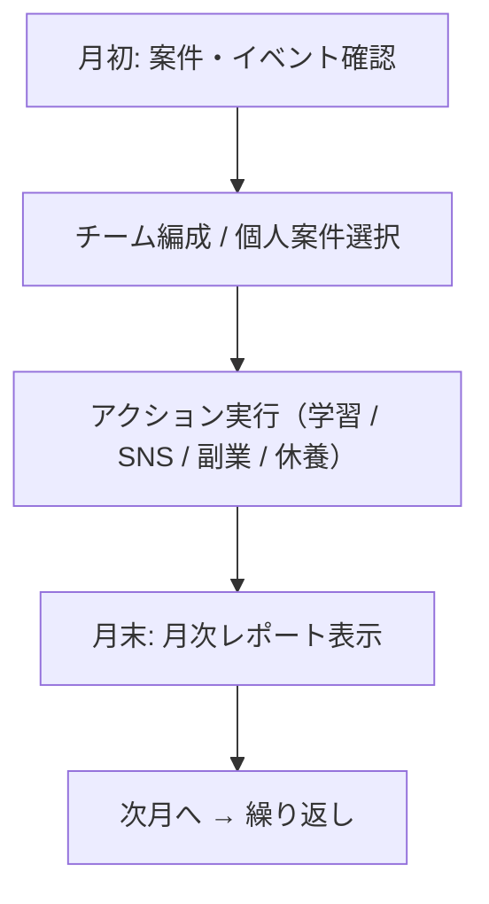

# Deploy Your Life 🚀

**React × 状態管理で作る、エンジニア向けライフシミュレーションゲーム**

[](https://github.com/Mimic52006masaki/DeployYourLife)

フリーランス・起業・SNS・AI時代をテーマに、  
「スキル習得・精神管理・収支判断」を月次ターン制で体験できる  
**プログラマー向けキャリアシミュレーションゲーム**です。

---

## 🌟 ゲーム特徴

### 🎯 リアルなキャリアパス
- アルバイト → 会社員 → フリーランス → 起業家 → 経営者
- JavaScript/Python/Designのスキルツリー
- 選択次第で精神・資金・影響力が変化

### 💰 現代的マネタイズ
- 副業案件（LP制作・API開発・データ分析）
- SNSフォロワーによる報酬倍率
- 法人化によるストック収入

### 🤖 AI時代対応
- AI Proサブスクで効率化（精神消費軽減・成功率UP）
- 月額固定費のマネジメント要素あり

### 👥 社員雇用システム
- 雇用・育成で収益拡大（レベルアップ・ボーナス）
- チーム編成で高額案件対応
- ランダムイベント・疲労管理でリアルなマネジメント

### 📊 月次レポート
- 収入・支出の詳細内訳
- 精神変動フィードバック
- 意思決定履歴の可視化

---

## 🎮 ゲームシステム

### 行動（毎月最大2回）
- **学習**: JavaScript / Python / Design Lvアップ（¥20,000）
- **SNS投稿**: フォロワー獲得（バズ/炎上/通常）
- **副業実行**: 即金収入（精神リスクあり）
- **休養**: 精神回復（収入なし）

### 精神システム
- 精神値で状態変化（安定 / 疲労 / 注意 / 危険）
- 高すぎるとケアレスミス・体調不良
- 低すぎるとバーンアウト

### 成長要素
- 言語スキルで案件解禁
- フォロワー数で副業報酬倍率
- 所持金で法人化可能

### 社員雇用システム
- 雇用: ランダム得意スキル付き（¥50,000）
- チーム編成: 高額案件で社員選択（最大人数制限）
- 育成・ボーナス: 月次レベルアップ・収益ボーナス
- リスク管理: 疲労・ランダムイベントによる収益変動

---

## 🏁 エンディング（評価システム）

12ヶ月終了時に以下から総合スコアを算出：

- 所持金
- 習得スキル（JavaScript / Python / Design）
- 精神状態
- フォロワー数
- 社員数・平均レベル（マネジメント評価）

### 評価ランク例
- **Aランク**: 安定した個人開発者
- **Bランク**: 攻める準備が整ったエンジニア
- **Cランク**: 生活はできるが余裕なし
- **Fランク**: 破産寸前

---

## 🔄 ゲーム進行フロー



---

## 📁 プロジェクト構造

```
/src
├─ components/
│  ├─ CommandMenu.jsx
│  ├─ EmployeeCard.jsx
│  ├─ EmployeeList.jsx
│  ├─ TeamAssignmentModal.jsx
│  ├─ SummaryModal.jsx
│  └─ TrendChart.jsx
├─ contexts/
│  └─ GameStateContext.jsx
├─ hooks/
│  └─ useGameState.js
├─ App.jsx
└─ main.jsx
```

### Context + Reducer 概要（開発者向けTips）

* `gameState`構造例:

```js
gameState = {
  player: { money, mental, skills, followers },
  economy: { monthlyIncome, expenses },
  quests: { availableJobs, completedJobs },
  ai: { proStatus },
  game: { month, actionsRemaining }
}
```

* `dispatch(action)`で状態更新
* アクション: `learn`, `job`, `post`, `rest`, `incorporate`

---

## 🎨 UIデザイン思想

### コンセプト: ネオレトロ × ターミナル × モダン

* レトロゲーム感: `border-2` + `shadow-[4px_4px_0px]`
* ターミナルUI: ログ出力・コマンドメニュー風
* モダン演出: animate-in, backdrop-blur, ring-offset

### 状態とUI同期

```js
width: `${100 - gameState.mental}%`
bg-red-500 // 危険域
```

---

## 🛠 技術スタック

* **Frontend**: React 18 + Hooks
* **Styling**: Tailwind CSS + Lucide Icons
* **Charts**: Recharts
* **Build**: Vite
* **State**: Context + useReducer
* **Language**: JavaScript (ES6+)

---

## 🚀 プレイ方法

```bash
# リポジトリをクローン
git clone https://github.com/Mimic52006masaki/DeployYourLife.git

# 依存関係インストール
npm install

# 開発サーバー起動
npm run dev

# ブラウザで http://localhost:5173
```

---

## 📈 開発ロードマップ

| バージョン    | 実装内容                                                   |
| -------- | ------------------------------------------------------ |
| v0.1~0.2 | ターン制ゲームループ / 言語スキル / 副業案件 / SNS / AIサブスク / Tailwind UI |
| v0.3     | 月次レポートモーダル / アニメーション演出強化 / イベント演出準備                    |
| v0.3.1   | TrendChart導入 / 過去6ヶ月トレンド可視化                            |
| v0.4     | 社員雇用・育成システム / 収益連動 / TeamAssignmentModal最終版            |
| v0.5     | プロダクト開発案件 / 大型イベント(M&A,炎上,バズ) / エンディング分岐拡張             |
| v1.0     | チュートリアル / セーブ/ロード / フルキャリアシミュレーション / マルチエンディング         |

---

## 🤝 コントリビュート

バグ修正・機能追加・UI改善歓迎！

```bash
git checkout -b feature/new-feature
git commit -m "Add new feature"
git push origin feature/new-feature
# GitHubでPR作成
```

---

## 📄 ライセンス

MIT License - 個人・商用問わず使用可能

---

## 🙌 作者

**Mimic52006masaki**
GitHub: [@Mimic52006masaki](https://github.com/Mimic52006masaki/DeployYourLife)

---

## 🎯 コンセプト

> **Code your way to freedom**
> プログラミングスキルで現実を変える。
> フリーランス・起業家のリアル挑戦をデータドリブンゲームで体験。
> **Deploy Your Life** - コードで人生をデプロイせよ。

---

## 📞 お問い合わせ

バグ報告・機能リクエスト・感想などは [Issues](https://github.com/Mimic52006masaki/DeployYourLife/issues) まで！

---

## 🖼 UI/GIF例（挿入イメージ）


