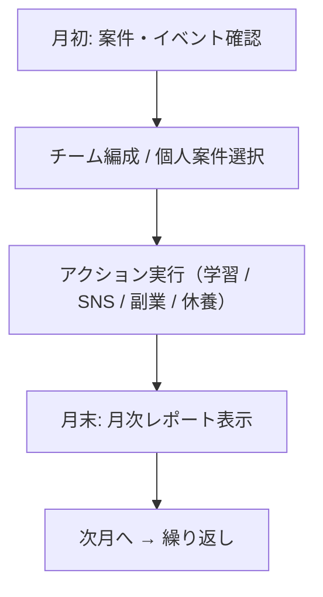

# Deploy Your Life 🚀

**React × 状態管理で作る、エンジニア向けライフシミュレーションゲーム**

[](https://github.com/Mimic52006masaki/DeployYourLife)

フリーランス・起業・SNS・AI時代をテーマに、  
「スキル習得・精神管理・収支判断」を月次ターン制で体験できる  
**プログラマー向けキャリアシミュレーションゲーム**です。

---

## 🌟 ゲーム特徴

### 🎯 リアルなキャリアパス
- アルバイト → 会社員 → フリーランス → 起業家 → 経営者
- JavaScript/Python/Designのスキルツリー
- 選択次第で精神・資金・影響力が変化

### 💰 現代的マネタイズ
- 副業案件（LP制作・API開発・データ分析）
- SNSフォロワーによる報酬倍率
- 法人化によるストック収入

### 🤖 AI時代対応
- AI Proサブスクで効率化（精神消費軽減・成功率UP）
- 月額固定費のマネジメント要素あり

### 👥 社員雇用システム
- 雇用・育成で収益拡大（レベルアップ・ボーナス）
- チーム編成で高額案件対応
- ランダムイベント・疲労管理でリアルなマネジメント

### 📊 月次レポート
- 収入・支出の詳細内訳
- 精神変動フィードバック
- 意思決定履歴の可視化

---

## 🎮 ゲームシステム

### 行動（毎月最大2回）
- **学習**: JavaScript / Python / Design Lvアップ（¥20,000）
- **SNS投稿**: フォロワー獲得（バズ/炎上/通常）
- **副業実行**: 即金収入（精神リスクあり）
- **休養**: 精神回復（収入なし）

### 精神システム
- 精神値で状態変化（安定 / 疲労 / 注意 / 危険）
- 高すぎるとケアレスミス・体調不良
- 低すぎるとバーンアウト

### 成長要素
- 言語スキルで案件解禁
- フォロワー数で副業報酬倍率
- 所持金で法人化可能

### 社員雇用システム
- 雇用: ランダム得意スキル付き（¥50,000）
- チーム編成: 高額案件で社員選択（最大人数制限）
- 育成・ボーナス: 月次レベルアップ・収益ボーナス
- リスク管理: 疲労・ランダムイベントによる収益変動

---

## 🏁 エンディング（評価システム）

12ヶ月終了時に以下から総合スコアを算出：

- 所持金
- 習得スキル（JavaScript / Python / Design）
- 精神状態
- フォロワー数
- 社員数・平均レベル（マネジメント評価）

### 評価ランク例
- **Aランク**: 安定した個人開発者
- **Bランク**: 攻める準備が整ったエンジニア
- **Cランク**: 生活はできるが余裕なし
- **Fランク**: 破産寸前

---

## 🔄 ゲーム進行フロー



---

## 📁 プロジェクト構造

```
/src
├─ components/
│  ├─ ActionButton.jsx
│  ├─ CommandMenu.jsx
│  ├─ EmployeeCard.jsx
│  ├─ EmployeeList.jsx
│  ├─ HUD.jsx
│  ├─ IncomeBarChart.jsx
│  ├─ JobCard.jsx
│  ├─ JobList.jsx
│  ├─ SkillBar.jsx
│  ├─ StatusPanel.jsx
│  ├─ SummaryModal.jsx
│  ├─ SystemLogs.jsx
│  ├─ TeamAssignmentModal.jsx
│  └─ TrendChart.jsx
├─ contexts/
│  └─ GameStateContext.jsx
├─ App.jsx
└─ main.jsx
```

### Context + Reducer 概要（開発者向けTips）

* `gameState`構造例:

```js
gameState = {
  player: { money, mental, skills, followers },
  economy: { monthlyIncome, expenses },
  quests: { availableJobs, completedJobs },
  ai: { proStatus },
  game: { month, actionsRemaining }
}
```

* `dispatch(action)`で状態更新
* アクション: `learn`, `job`, `post`, `rest`, `incorporate`

---

## 🎨 UIデザイン思想

### コンセプト: ネオレトロ × ターミナル × モダン

* レトロゲーム感: `border-2` + `shadow-[4px_4px_0px]`
* ターミナルUI: ログ出力・コマンドメニュー風
* モダン演出: animate-in, backdrop-blur, ring-offset

### 状態とUI同期

```js
width: `${100 - gameState.mental}%`
bg-red-500 // 危険域
```

---

## 🛠 技術スタック

* **Frontend**: React 18 + Hooks
* **Styling**: Tailwind CSS + Lucide Icons
* **Charts**: Recharts
* **Build**: Vite
* **State**: Context + useReducer
* **Language**: JavaScript (ES6+)

---

## 🚀 プレイ方法

```bash
# リポジトリをクローン
git clone https://github.com/Mimic52006masaki/DeployYourLife.git

# 依存関係インストール
npm install

# 開発サーバー起動
npm run dev

# ブラウザで http://localhost:5173
```

---

## 📈 開発ロードマップ

| バージョン    | 実装内容                                                   |
| -------- | ------------------------------------------------------ |
| v0.1~0.2 | ターン制ゲームループ / 言語スキル / 副業案件 / SNS / AIサブスク / Tailwind UI |
| v0.3     | 月次レポートモーダル / アニメーション演出強化 / イベント演出準備                    |
| v0.3.1   | TrendChart導入 / 過去6ヶ月トレンド可視化                            |
| v0.4     | 社員雇用・育成システム / 収益連動 / TeamAssignmentModal最終版            |
| v0.5     | プロダクト開発案件 / 大型イベント(M&A,炎上,バズ) / エンディング分岐拡張             |
| v1.0     | チュートリアル / セーブ/ロード / フルキャリアシミュレーション / マルチエンディング         |

---

## 🤝 コントリビュート

バグ修正・機能追加・UI改善歓迎！

```bash
git checkout -b feature/new-feature
git commit -m "Add new feature"
git push origin feature/new-feature
# GitHubでPR作成
```

---

## 📄 ライセンス

MIT License - 個人・商用問わず使用可能

---

## 🙌 作者

**Mimic52006masaki**
GitHub: [@Mimic52006masaki](https://github.com/Mimic52006masaki/DeployYourLife)

---

## 🎯 コンセプト

> **Code your way to freedom**
> プログラミングスキルで現実を変える。
> フリーランス・起業家のリアル挑戦をデータドリブンゲームで体験。
> **Deploy Your Life** - コードで人生をデプロイせよ。

---

## 📞 お問い合わせ

バグ報告・機能リクエスト・感想などは [Issues](https://github.com/Mimic52006masaki/DeployYourLife/issues) まで！

---

## 🖼 UI/GIF例（挿入イメージ）


---

# 🎮 Deploy Your Life

## フェーズ × 個人開発 統合仕様（確定版）

---

## 🎯 ゲームの軸（再定義）

このゲームは以下の3本柱で進行する：

1. **フェーズ（人生ステージ）**
2. **スキル成長（学習）**
3. **個人開発 × SNS × 収益化**

👉 フェーズは「できることの制限」
👉 スキルは「どこまで深くできるか」

---

## 🧭 フェーズ一覧（最終確定）

```txt
student → parttime → employee → freelance → corporation
```

※ `player.job` / `game.corporation` は
**最終的に `game.phase` に一本化する前提**

---

# 🧑‍🎓 Phase 0：student（準備期間 / チュートリアル）

### 概要

* 完全な下積み期間
* お金は基本的に減る
* 「学習 × 発信 × 試作」を体験する

### できること

* 📖 学習（JS / Python / Design）
* 📱 SNS投稿
* 💤 休養
* 🛠 個人開発（※収益なし）

### できないこと

* ❌ 案件受注
* ❌ 社員雇用
* ❌ 法人化
* ❌ プロプラン
* ❌ 決済機能実装

### 個人開発の扱い

* アプリ作成・デプロイは可能
* **決済がわからず収益 ¥0**

```txt
🚀 アプリを公開した！
😇 でも決済機能がなく収益は¥0…
```

### 目的

* いずれかの言語 Lv1
* フォロワー 100人

---

# 🧑‍💼 Phase 1：parttime（バイト）

### 概要

* 生活費ギリギリ
* 「副業」の入口

### できること

* 📖 学習
* 📱 SNS投稿
* 💤 休養
* 💼 バイト収入（自動）
* 🧩 低難度案件（デバッグ等）
* 🛠 個人開発（少額化の準備）

### できないこと

* ❌ 社員雇用
* ❌ 高額案件
* ❌ 法人化
* ❌ プロプラン

### 個人開発

* **スキル次第で収益化が始まる**
* 月 ¥100〜¥1,000 程度

### 解放条件（→ employee）

* JS or Python Lv1
* 所持金 ¥300,000

---

# 🧑‍💻 Phase 2：employee（会社員）

### 概要

* 安定収入と引き換えに時間が消える
* 現実的な「停滞フェーズ」

### できること

* 📖 学習（コスト増）
* 📱 SNS投稿
* 💤 休養
* 💼 固定給 ¥220,000
* 🧩 中難度案件
* 🛠 個人開発（継続可）

### 制限

* 行動回数 -1（忙しい）

### できないこと

* ❌ 社員雇用
* ❌ 法人化

### 個人開発

* 収益は出るが伸ばしづらい
* 「時間不足」を強く感じる

### 解放条件（→ freelance）

* JS or Python Lv2
* 月案件収入 ¥150,000
* フォロワー 300人

---

# 🧑‍🚀 Phase 3：freelance（独立）

### 概要

* すべてが自己責任
* 初めて「事業主」になる

### できること

* 🧩 高額案件
* 👥 社員雇用（1〜2人）
* 📦 プロダクト販売（主軸化）
* 📱 SNS影響力UP
* 💳 プロプラン

### 制限

* 生活費増加
* 固定費プレッシャー

### 条件付き制限

* 社員雇用：所持金 ¥300,000 以上

### 個人開発

* **最も伸びるフェーズ**
* バズ・改善・拡張が強力

### 解放条件（→ corporation）

* フォロワー 500人
* 社員 2人
* 月収 ¥500,000

---

# 🏢 Phase 4：corporation（法人）

### 概要

* 組織経営シミュレーションに変化
* 金と人を回すゲーム

### できること

* 👥 社員無制限
* 🏢 法人案件
* 📈 自動収益
* 🤖 AI戦略（pro 強化）
* 🧾 プロダクト事業化

### できないこと

* ❌ バイト・会社員収入

### エンディング条件

* 12ヶ月生存
* 総資産 or 会社評価で評価

---

# 🔧 個人開発システム（フェーズ横断）

## 原則

* **フェーズでは制限しない**
* **スキルレベルで解放**

---

## 📊 スキルレベル × 個人開発

### 🔰 Lv1：作れるが稼げない

* JS Lv1
* 作成・デプロイ可能
* 収益 ¥0

---

### 💡 Lv2：少額収益

* JS Lv2 + Python Lv1
* 💳 決済機能解放
* ¥100〜¥1,000 / 月

```js
income = 100 * Math.log10(followers + 10)
```

---

### 🚀 Lv3：スケール

* JS Lv3 + Design Lv1
* UI改善 / バズ補正
* ¥1,000〜¥50,000

---

### 🏆 Lv4：本格事業

* JS Lv4 + Design Lv2
* 年額・チーム開発
* ¥10,000〜¥1,000,000

---

## 📦 プロダクト構造

```js
products: [
  {
    id,
    name,
    stage, // prototype / released / monetized
    hasPayment,
    quality,
    users,
    monthlyRevenue,
    lastBuzz,
  }
]
```

---

## 📈 月次収益ロジック

```js
if (!hasPayment) return 0;

revenue =
  base *
  scale(followers) *
  qualityBonus *
  buzzFactor;
```

---

# 🧠 実装原則（最重要）

### ① アクションはフェーズでガード

```js
if (!phaseRules[action].includes(phase)) {
  addLog('このフェーズでは実行できません');
}
```

### ② UI は隠さない

```txt
🔒 社員雇用
フリーランス到達で解放
```

### ③ フェーズ変更はイベント

```txt
🚀 フリーランスとして独立しました！
```

---

## ✅ ここまでで何が良いか

* **現実的**
* **挫折と希望のバランス**
* **「あと少し」が明確**
* 個人開発が「逃げ道ではなく戦略」になる

---

## ✅ 実装済み機能（最新）

### 🔒 フェーズ制ガードシステム
- **フェーズ**: student → parttime → employee → freelance → corporation
- **アクション制限**: 各フェーズでできることを厳密に定義
- **UI表示**: ロックされたアクションは「🔒 [理由]」で表示
- **移行条件**: スキル・資金・フォロワーで自動移行

### 🛠 個人開発システム
- **段階**: prototype → released → monetized
- **スキル要件**: develop (JS Lv1), deploy (無料), payment (JS Lv2 + Python Lv1)
- **収益ロジック**: hasPayment + quality + followers + users + buzz
- **ペナルティ**: deploy で quality -2（現実的なリリースリスク）

### 🧠 改善アクション
- **FIX BUG**: quality +5〜10, mental +10
- **UI IMPROVE**: quality +3, users +10, money -30,000
- **プロダクト別適用**: released+ の各アプリに個別実行

### 📢 マーケティングシステム
- **プロダクト別**: 各アプリにマーケティング施策実行
- **効果**: 成功/通常/失敗 のランダム結果
- **影響**: 次回 post の buzz率/炎上率/user増加 に反映
- **コスト**: ¥30,000

### 🔥 バズ・炎上影響
- **SNS投稿**: ランダムで released+ アプリに影響
- **バズ**: users +100〜300, ログ表示
- **炎上**: users -30%, mental +20, ログ表示
- **マーケティング連動**: 施策で確率操作可能

### 🎯 収益計算の現実化
- **ユーザー依存**: followers 60% + users 40%
- **スキルボーナス**: quality / 20
- **バズ倍率**: ランダムイベント

### 🎨 UI/UX改善
- **プロダクトリスト**: stage 別表示 + 条件付きボタン
- **ログ**: 詳細なフィードバック（アプリ名・効果）
- **フェーズ表示**: 現在の制限状態を明確化

---

## 🚀 次の実装予定

### 👥 社員アサインシステム
- **データ構造**: employee.assignedProductId
- **効果**: Developer (FIX効果UP), Designer (UI効果UP), Marketer (マーケティング効果UP)
- **UI**: EmployeeList でアサイン選択

### 📊 月次レポート強化
- **プロダクト別収益**: 各アプリの貢献度表示
- **社員パフォーマンス**: アサイン効果の可視化

### 🏆 エンディング拡張
- **スコアリング**: フェーズ・資産・影響力・チーム力
- **マルチエンディング**: 個人開発者/起業家/経営者 ルート